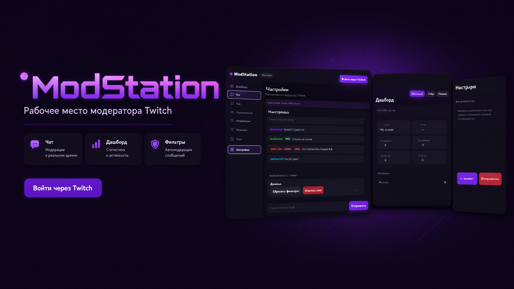

# ModStation 🛡️

**Рабочее место модератора Twitch.** Чат в реальном времени, автомодерация,
пользователи, логи и статистика — в одном дашборде в фирменном фиолетовом неоне Twitch.

  

  

## ✨ Возможности

- 💬 **Чат** — модерация в реальном времени: читай, отвечай, лови нарушителей
- 🛡 **Фильтры** — автомодерация: спам, ссылки и запрещённые слова подсвечиваются красным
- 👥 **Пользователи** — таймауты и баны без переключения вкладок
- 📊 **Дашборд** — статистика и активность канала
- 📜 **Логи** — история действий модерации
- 🔐 **Вход через Twitch** — OAuth, без паролей в приложении

## 📥 Установка

1. Скачай установщик: **[ModStation Setup 0.4.0.exe](https://drive.google.com/uc?export=download&id=1PbGtWNoJjoQ7X0VSwUQE-FGoBiQ8-j1H)**
2. Запусти → следуй инструкциям мастера
3. При первом запуске войди через Twitch OAuth

> 🔑 Нужен только аккаунт Twitch. Секретные ключи вводить не нужно — приложение использует безопасный OAuth.

## 📜 История версий

| Версия | Дата | Что нового |
|---|---|---|
| **0.4.0** | 2025 | Текущий стабильный релиз |

## 📄 Лицензия

[MIT](LICENSE)

---

  Для модераторов и стримеров, уставших от десятка вкладок. ⭐ на GitHub!

